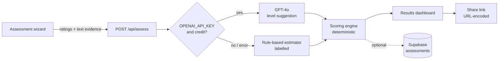

# Hirena — System architecture

> Status: AUTHORED · Updated 2026-09-23 · Owner: Ossama Mokhtar

**A Next.js 15 app where the score is deterministic and the model only suggests levels from the user's own text.** Nothing looks at the user's face or voice.

## Components

| Component | File | Role |
|---|---|---|
| Wizard | `src/components/assessment-wizard.tsx` | 5 steps: profile, goals, self-assessment, AI review of text evidence, summary |
| Competency model | `src/lib/competency-model.ts` | 35 PM skills in 6 pillars, career ladder |
| AI service | `src/lib/ai.ts` | `inferSkillLevel`, `inferAllSkills`, feedback, roadmap, resources (GPT-4o, JSON output); `AI_MODE` = auto / mock / production |
| Fallback estimator | `src/lib/mock-ai.ts` | Rule-based levels from text; every result prefixed "Rule-based estimate — no AI model was called" |
| Scoring engine | `src/lib/scoring-engine.ts` | Role-weighted pillar scores, strengths, gaps, roadmap buckets |
| Results | `src/components/results-dashboard.tsx` | Score, pillar breakdown, gaps, roadmap, evidence per skill |
| Persistence | `src/lib/db.ts`, `src/lib/user-service.ts` | Supabase `assessments` and `profiles` tables, optional |
| Sharing | `src/lib/report/generator.ts`, `/share/[id]` | Encodes a summary in the URL; no server lookup |
| i18n | `src/lib/i18n.ts`, `i18n-provider.tsx` | English and Arabic strings, RTL |

## Order of trust

1. The user's own ratings are the default.
2. A model suggestion replaces a rating only when the user supplied text evidence for that skill, and the result shows it as "AI-inferred" with confidence and reasoning.
3. The score is computed by code the user could re-run by hand.
