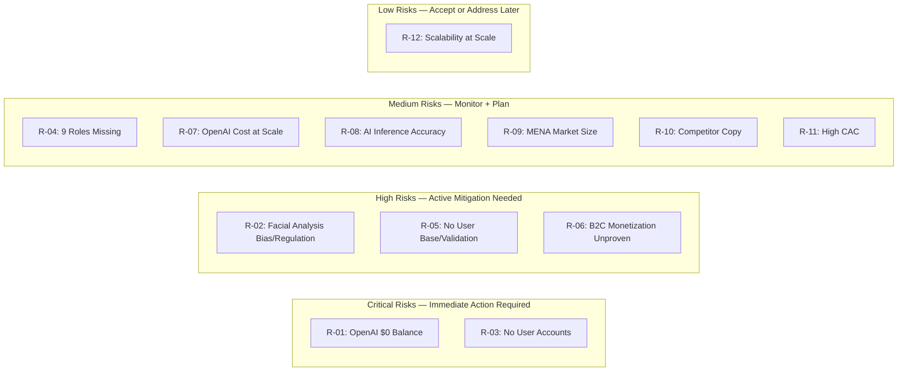

# Hirena — Impact Analysis

**Version:** 2.0  
**Last Updated:** September 12, 2026  
**Scope:** Technical, Business, Risk, Compliance, Operational Impact  

---

## Executive Summary

Hirena is a high-potential B2C freemium career development platform with strong differentiation (MENA-first, bilingual, hybrid self+AI assessment, multi-role competency models, real-time interview practice with avatar mentor). However, execution risk is significant: 9 of 14+ role models incomplete, no user accounts wired, OpenAI integration blocked by $0 balance, facial analysis carries regulatory/bias risk.

**Overall Impact Assessment:** High upside (unique market position, sticky B2C use case, MENA-first movers advantage) with moderate-high execution risk (incomplete product, no users, AI dependency, compliance considerations).

---

## 1. Technical Impact

### 1.1 Current Architecture Impact

| Component | Status | Impact if Delayed | Risk |
|-----------|--------|-------------------|------|
| Landing page + demo | ✅ Complete | Low — demos stakeholder buy-in | Low |
| PM competency model (35 skills) | ✅ Complete | Low — foundation built | Low |
| Assessment wizard (5-step) | ✅ Complete | Medium — core user flow incomplete | Medium |
| Results dashboard | ✅ Complete | Medium — users can't see results | Medium |
| Scoring engine | ✅ Complete | Low — logic working | Low |
| 4 engineering role models | ✅ Complete | High — 9 roles missing limits market coverage | High |
| Option 2/3 APIs (voice/facial/fusion/interview) | ✅ Complete | High — interview practice not functional without APIs | High |
| Real-time interview wizard + avatar | ✅ Complete | High — interview practice not usable | High |
| User accounts + Supabase | ❌ Not started | Critical — no persistence, no retention, no recurring value | High |
| Real AI integration (GPT-4o) | ❌ Blocked ($0 balance) | Critical — AI inference not working | High |
| Bilingual AR/EN full implementation | 🔄 In progress | Medium — MENA users can't use in Arabic | Medium |
| MENA benchmarks display | 🔄 In progress | Medium — differentiation not visible to users | Medium |
| Bias mitigation + compliance | 🔄 In progress | High — facial analysis risk unaddressed | High |

### 1.2 Architecture Scalability Impact

**Current State:**
- Next.js 15 + TypeScript + Tailwind + Shadcn/UI — solid foundation
- Serverless API routes (Vercel) — auto-scaling, but cold starts possible
- In-memory session storage for WebSocket (not persistent, not horizontal-scaling ready)
- No database (localStorage only for demo) — not scalable beyond demo

**Impact of Scaling:**
- **User accounts + Supabase:** Required before any meaningful scale. Enables persistence, auth, assessment history, progress tracking.
- **Real-time interview session store:** In-memory Map won't work with multiple Vercel instances. Need Redis or Supabase realtime for production.
- **API rate limiting:** Not implemented. Needed to prevent abuse + manage OpenAI costs.
- **CDN + caching:** Not optimized. Landing page could benefit from static generation + CDN caching.

**Recommendations:**
1. **Priority 1:** Wire Supabase (auth + DB) — enables persistence, auth, history, scalability foundation
2. **Priority 2:** Replace in-memory session store with Redis or Supabase Realtime for WebSocket sessions
3. **Priority 3:** Add rate limiting to all API routes (especially assess + interview)
4. **Priority 4:** Optimize landing page with static generation + CDN caching

### 1.3 Technical Debt Assessment

| Debt | Severity | Payoff | Action |
|------|----------|--------|--------|
| In-memory session storage (interview/session/route.ts) | High | Enables horizontal scaling + session persistence | Replace with Redis or Supabase Realtime in Phase 1-2 |
| No rate limiting on APIs | High | Prevents abuse + manages OpenAI costs | Add rate limiting (Vercel middleware or Upstash Redis) in Phase 1 |
| localStorage only (no DB) | Critical | Enables user accounts + persistence + retention | Wire Supabase in Phase 1 (critical priority) |
| No logging/monitoring | Medium | Enables debugging + incident response + analytics | Add logging (Vercel logs + optional Sentry/PostHog) in Phase 1-2 |
| No CI/CD pipeline | Medium | Enables automated testing + deployment | GitHub Actions stub exists (PR #11 open) — complete in Phase 1 |
| Demo uses pre-computed static data | Low | Blocks real AI testing | Unblock by adding OpenAI credits; keep demo path as fallback |
| Facial analysis simulated only | Medium | Blocks real facial analysis testing | Unblock with AWS Rekognition/DeepFace in Phase 2 |
| Voice analysis simulated only | Medium | Blocks real voice analysis testing | Unblock with Deepgram/AssemblyAI in Phase 2 |

---

## 2. Business Impact

### 2.1 Revenue Impact

**Revenue Model:**
- Freemium: Free assessment + basic roadmap (acquisition)
- Premium Individual: $9.99/month or $99/year (detailed analysis, career path viz, progress tracking, learning content, mentor matching, shareable reports, all-region benchmarks, unlimited assessments)
- Interview Practice Packs: $19.99 (5 sessions) or $49.99 (15 sessions)
- B2B Team/Enterprise (future): $50-200/user/month or $50K-500K/year

**Revenue Scenarios (3-Year):**

| Scenario | Year 1 | Year 2 | Year 3 |
|----------|--------|--------|--------|
| **Conservative** | $8K | $40K | $120K |
| **Realistic (Base)** | $63K | $315K | $920K |
| **Aggressive** | $435K | $1.99M | $6.12M |

**Key Assumptions:**
- Conversion rate: 5-12% of registered users become paying
- CAC: $20-50 depending on channel
- LTV: $150 (3-year subscription) to $300+ (with interview packs)
- LTV:CAC ratio: 3:1 (conservative) to 15:1 (aggressive)

**Revenue Risk Factors:**
- Conversion rate unproven — B2C freemium for career development is novel
- Interview pack pricing sensitive to OpenAI costs ($5-13/interview)
- B2B expansion adds revenue but requires different sales motion + longer cycles

### 2.2 Market Impact

**Differentiation Impact:**
- **B2C Individual Focus:** Strong differentiation vs all major competitors (all B2B employer-facing). Reduces direct competition.
- **MENA-First + Bilingual AR/EN:** Unique positioning. No competitor offers MENA benchmarks or Arabic-first UX. Creates defensible regional niche.
- **Hybrid Assessment (Self + AI):** More accurate than pure self-assessment or pure AI. Unique approach. Competitors are test-based (Vervoe, TestGorilla) or AI-only (Eightfold).
- **Multi-Role Competency Models + Career Ladders:** Comprehensive framework (14+ roles, 370+ skills, career progression). Competitors offer tests or AI scoring, not structured competency models.
- **Real-Time Interview Practice + Multi-Modal + Avatar:** Differentiator vs Talentee (closest B2C competitor). Talentee has interview practice but lacks multi-role models, self-assessment, MENA benchmarks, bilingual, avatar mentor.

**Market Risk Factors:**
- LLM commoditization — "AI-powered" moat erodes as GPT-4o/Claude/Gemini become ubiquitous
- Competitors could add B2C features (Eightfold, TestGorilla have resources)
- MENA market size limited — must expand to global eventually

### 2.3 Competitive Response Impact

**Likely Competitor Responses:**
1. **Talentee:** Could add self-assessment, MENA benchmarks, bilingual support. Moderate threat — smaller company, less resources.
2. **Eightfold/Vervoe/TestGorilla:** Could add B2C individual tools. Low threat in short-term (focused on B2B enterprise). High threat in long-term if they see B2C opportunity.
3. **New Entrants:** Low barrier to entry for basic assessment tools (GPT-4o + simple UI). Higher barrier for Hirena's full package (multi-role models + MENA benchmarks + bilingual + real-time interview + avatar).
4. **LinkedIn Learning / Coursera:** Could add skill assessment features. Low threat (focused on content, not assessment).

**Defensibility:**
- **High:** MENA benchmarks (hard to replicate without regional data), bilingual AR/EN (requires Arabic expertise), multi-role competency models (core IP, significant effort to build), B2C focus (competitors are B2B-focused).
- **Medium:** "AI-powered" (commoditized by GPT-4o/Claude/Gemini availability).
- **Low:** Basic assessment wizard (easy to copy).

**Recommendation:** Invest in moat-building features: MENA benchmarks (expand to all roles), bilingual depth (all UI + content), competency models (complete all 14+ roles), career roadmap (curated content + mentor matching + career path viz). These are harder to replicate than basic AI assessment.

---

## 3. Risk Analysis

### 3.1 Risk Register

| # | Risk | Category | Likelihood | Impact | Risk Score | Mitigation | Owner |
|---|------|----------|------------|--------|------------|------------|-------|
| R-01 | OpenAI account balance $0 → 429 errors, AI features blocked | Technical | High (current state) | High (blocks AI inference) | **Critical** | Add credits ($10-20); keep demo path as fallback; Phase 2 architecture allows service swapping | Engineering |
| R-02 | Facial analysis bias + regulatory risk (EU AI Act, NYC LL144, Colorado) | Compliance + Ethical | Medium | High (could force facial analysis removal) | **High** | Treat as optional/experimental + disclaimer; voice + content as core; document bias risk; monitor regulations; prepared to drop if necessary | AI PM + Legal |
| R-03 | No user accounts + no persistence → no retention, no recurring value | Product | High (current state) | High (users can't return, can't track progress) | **Critical** | Wire Supabase auth + user profiles + assessment history in Phase 1 (critical priority) | Engineering |
| R-04 | 9 of 14+ role models not built → limited market coverage | Product | High (current state) | Medium (PM + 4 engineering roles is good start, but incomplete) | **Medium** | Build remaining 9 roles in Phase 2; prioritize most important first (DevOps, Data Engineer, UX/UI, Eng Manager) | Product + Engineering |
| R-05 | No user base + no validation → value prop unproven | Business | High (current state) | High (could build something nobody wants) | **High** | Launch demo → measure → iterate; start with MVP, gather feedback, refine before heavy investment | Product |
| R-06 | B2C monetization unproven → unclear revenue model | Business | Medium | High (could build free product with no revenue path) | **High** | Test premium features with small user group; iterate on pricing; consider B2B expansion if B2C monetization fails | Product + GTM |
| R-07 | GPT-4o cost per interview ($5-13) → unsustainable at scale | Financial | Medium | Medium (profitability depends on optimization) | **Medium** | Phase 2 architecture allows swapping cheaper services (Deepgram for voice, AWS Rekognition for facial); consider open-source models long-term; optimize token usage | Engineering + Finance |
| R-08 | LLM quality insufficient for skill inference → inaccurate results | AI Quality | Medium | Medium (users lose trust if AI is wrong) | **Medium** | Show confidence score with each inference; allow users to override; use hybrid approach (AI + self-rating); test accuracy when credits available | AI PM |
| R-09 | MENA market too small → can't scale | Market | Low-Medium | High (if true, must expand globally) | **Medium** | MENA is entry point; expand to APAC, NA, EMEA in Phase 2; MENA-first is differentiation, not limitation | Product + GTM |
| R-10 | Competitors copy B2C features → differentiation erodes | Competitive | Medium | Medium (competitors have resources to copy) | **Medium** | Build defensible moat: MENA benchmarks, bilingual depth, competency models, career roadmap; move fast to establish position | Product + Strategy |
| R-11 | User acquisition cost high → unsustainable CAC | Go-to-Market | Medium | Medium (if CAC > LTV, unsustainable) | **Medium** | Focus on organic channels (SEO, LinkedIn, referrals) first; test paid channels carefully; build viral loops (shareable results) | Marketing + Product |
| R-12 | Technical scalability issues at scale | Technical | Low (current state) | High (if hit scale, system breaks) | **Low-Medium** | Address in Phase 1-2: Supabase for persistence, Redis for sessions, rate limiting, caching, monitoring | Engineering |

### 3.2 Risk Heat Map

### 3.3 Risk Mitigation Priorities

**Immediate (Before Launch):**
1. Add OpenAI credits ($10-20) to unblock AI inference path
2. Wire Supabase auth + user profiles + assessment history (critical for retention)
3. Implement facial analysis disclaimer + optional/experimental toggle
4. Complete bilingual AR/EN implementation across all UI
5. Display MENA benchmarks for PM role in results dashboard

**Short-Term (Phase 1-2):**
6. Build remaining 9 role models (prioritize DevOps, Data Engineer, UX/UI, Eng Manager first)
7. Test GPT-4o skill inference accuracy with real users
8. Build curated learning content library (partner with existing platforms)
9. Implement career path visualization + progress tracking
10. Add rate limiting + logging + monitoring to all APIs

**Medium-Term (Phase 2-3):**
11. Test premium pricing + features with small user group
12. Expand MENA benchmarks to all 14+ roles
13. Add APAC + NA + EMEA benchmarks
14. Evaluate facial analysis continuation vs removal based on user feedback + regulatory developments
15. Prepare B2B expansion strategy if B2C monetization insufficient

---

## 4. Compliance & Regulatory Impact

### 4.1 Regulatory Landscape

| Regulation | Scope | Applicability to Hirena | Risk Level | Mitigation |
|------------|-------|-------------------------|------------|------------|
| **EU AI Act** | High-risk AI systems (hiring, promotion, evaluation) | **High** — Facial analysis for assessment/judgment is high-risk. Must have transparency, human oversight, bias testing, logging. | **High** | Facial analysis optional/experimental + disclaimer; voice + content as core; bias documentation; monitor regulations |
| **NYC Local Law 144** | Automated employment decision tools (AEDT) | **Medium** — Applies if Hirena used for employment decisions (hiring, promotion). As B2C career development tool, may not apply directly. Monitor if B2B expansion. | **Medium** | Monitor applicability; if B2B, conduct bias audit; transparency reporting |
| **Colorado AI Act** | High-risk AI systems (effective 2026) | **Medium** — Similar to EU AI Act. Applies to high-risk AI. Facial analysis for assessment may qualify. | **Medium** | Same as EU AI Act mitigation |
| **GDPR** | Personal data protection (EU users) | **Low-Medium** — Applies when Hirena has EU users + stores personal data. Future: Supabase + user accounts trigger GDPR obligations. | **Low (now) → Medium (later)** | Data minimization; user consent; data deletion rights; privacy policy; DPO if needed |
| **SOC 2** | Security + availability + confidentiality | **Low (MVP)** — Enterprise B2B customers may require. Not needed for B2C MVP. | **Low (now) → High (B2B)** | If B2B expansion: invest in SOC 2 compliance (6-12 months, $50-100K) |

### 4.2 Facial Analysis — Specific Compliance Impact

**HireVue Precedent (January 2021):**
- HireVue dropped facial analysis from hiring platform after criticism from AI Now Institute and lawmakers
- Statement: "HireVue will drop facial analysis from its hiring platform, citing concerns about bias and the lack of scientific evidence that facial expressions predict job performance."

**TestGorilla Approach:**
- "TestGorilla's AI interviews use transcript-only scoring — no facial analysis — to avoid bias risk."

**Criteria Corp Approach:**
- "Interview Intelligence uses I-O psychology-backed transcript analysis only. No facial analysis."

**Hirena's Position:**
- Facial analysis is differentiator vs Talentee (closest competitor)
- But carries same risk as HireVue (bias, regulation, scientific validity)
- **Decision:** Include as optional/experimental with disclaimer. Voice + content as core. Monitor regulations. Be prepared to drop if necessary.

**Compliance Documentation Needed:**
1. Facial analysis disclaimer (user-facing): "Facial analysis is experimental and may contain biases. Not used for employment decisions. Use at your own discretion."
2. Internal bias risk documentation: Known limitations, biases, mitigation attempts
3. Regulatory monitoring: Track EU AI Act, NYC LL144, Colorado AI Act developments
4. User consent: If facial analysis is used, users must opt-in with clear disclosure
5. Data retention policy: How long facial analysis data is stored (ideally: not stored, processed in real-time only)

---

## 5. Operational Impact

### 5.1 Team & Resourcing Impact

**Current Team:**
- Product (Ossama Mokhtar): Full-time, driving architecture, product, documentation
- Engineering: 1 FTE equivalent (architecture built, competency models built, APIs built)
- Design: Light (Shadcn/UI + Tailwind, minimal custom design)

**Phase 1 Resourcing Needs:**
| role | effort | justification |
|------|--------|---------------|
| Product Manager | 1 FTE | Feature prioritization, user research, roadmap management, stakeholder communication |
| Frontend Engineer | 1 FTE | Bilingual implementation, user accounts UI, career path viz, analytics dashboard, Polish |
| Backend/Infrastructure | 0.5 FTE | Supabase wiring, API enhancements, benchmarks data, rate limiting |
| AI/ML Engineer | 0.5 FTE | GPT-4o integration, voice/facial analysis optimization, bias testing, cost optimization |
| Content/Curation | 0.5 FTE | Learning content library, mentor matching, MENA benchmarks research |

**Total Phase 1 Team:** ~3.5 FTE (could be 2-3 people with overlap)

**Phase 2 Resourcing Needs:**
| role | effort | justification |
|------|--------|---------------|
| Product Manager | 1 FTE | Growth strategy, B2B exploration, advanced features |
| Frontend Engineer | 2 FTE | Real-time voice UI, avatar rendering, gamification, performance optimization |
| Backend Engineer | 1 FTE | Real-time WebSocket, scaling, performance, integrations |
| AI/ML Engineer | 1 FTE | Advanced AI features, model optimization, cost control, evaluation |
| DevOps/SRE | 0.5 FTE | Infrastructure scaling, monitoring, reliability, CI/CD |
| GTM/Marketing | 1 FTE | User acquisition, B2B sales, partnerships, content marketing |

**Total Phase 2 Team:** ~6.5 FTE

### 5.2 Cost Impact

**Phase 1 Costs (Q3-Q4 2026):**
| Category | Monthly | Notes |
|----------|---------|-------|
| OpenAI API (GPT-4o) | $0-2K | Depends on usage; $5-13/interview; demo bypasses API |
| Specialized Services (Deepgram, AWS, D-ID) | $0 | Not used in Phase 1 (simulated) |
| Infrastructure (Vercel, Supabase) | $0-50 | Vercel free tier + Supabase free tier; scale with usage |
| Development Team (3.5 FTE) | $35-50K | Assuming $10-15K/month per FTE (MENA-based team) |
| **Total Monthly** | **$35-52K** | |

**Phase 2 Costs (Q1-Q2 2027):**
| Category | Monthly | Notes |
|----------|---------|-------|
| OpenAI API (GPT-4o) | $5-20K | Real usage; depends on interview volume |
| Specialized Services (Deepgram, AWS, D-ID) | $2-10K | Added in Phase 2 |
| Infrastructure (Vercel, Supabase, Redis, logging) | $500-2K | Scaling up |
| Development Team (6.5 FTE) | $65-97K | Scaling team |
| Marketing + User Acquisition | $5-20K | Paid channels + content + partnerships |
| **Total Monthly** | **$77-149K** | |

**Phase 3 Costs (Q3 2027+):**
| Category | Monthly | Notes |
|----------|---------|-------|
| OpenAI + Specialized Services | $10-50K+ | Scale-dependent |
| Infrastructure | $2-10K | Scale-dependent |
| Development Team (8-10 FTE) | $80-150K | Full product team |
| Marketing + GTM | $20-50K+ | Scale-dependent |
| Compliance + Legal | $5-10K | SOC 2, GDPR, regulatory monitoring |
| **Total Monthly** | **$117-270K+** | |

**Break-Even Analysis:**
- Phase 1: Not profit-focused (investment phase). Burn rate ~$35-52K/month.
- Phase 2: Break-even at ~150-300 paying users (at $99/year subscription). Realistic target: 500-1000 paying users by end of Phase 2.
- Phase 3: Profitable if user base grows to 5,000+ paying users.

---

## 6. Strategic Impact Summary

### 6.1 Positive Impacts (Opportunities)

1. **Unique Market Position:** B2C individual career development with MENA-first + bilingual + hybrid assessment + multi-role models + real-time interview practice. No direct competitor offers this combination.

2. **Sticky B2C Use Case:** Career development is recurring (users return to track progress, retake assessments, access new content). Higher retention than transactional tools.

3. **MENA-First Moat:** No competitor has MENA-specific benchmarks or Arabic-first UX. Creates defensible regional position before global competitors enter.

4. **Scalable AI Architecture:** Option 1→2→3 evolution allows cost optimization + service swapping. Not locked into single vendor.

5. **Freemium Viability:** Free assessment → personalized roadmap → premium features is proven B2C model (similar to fitness/health apps).

6. **Future B2B Expansion:** Individual users → team accounts → enterprise. LinkedIn shares + social proof build awareness for B2B.

### 6.2 Negative Impacts (Risks)

1. **Execution Risk:** 9 of 14+ roles incomplete, no user accounts, OpenAI blocked, facial analysis risk. Must execute well to realize potential.

2. **AI Dependency:** GPT-4o is primary AI supplier. Cost ($5-13/interview) + availability (account balance) + quality (inference accuracy) are risks.

3. **Regulatory Risk:** Facial analysis for assessment is high-risk under EU AI Act, NYC LL144, Colorado AI Act. Could force removal of key differentiator.

4. **Market Risk:** MENA market size limited. Must expand globally to scale. B2C monetization unproven.

5. **Competitive Risk:** LLM commoditization erodes "AI-powered" moat. Competitors could add B2C features. Need defensible moat (MENA benchmarks, bilingual, competency models, career roadmap).

6. **Resource Risk:** Requires 3.5-6.5 FTE to execute Phase 1-2. Funding needed to hire team + OpenAI credits + infrastructure.

### 6.3 Net Impact Assessment

| Dimension | Assessment | Confidence |
|-----------|------------|------------|
| **Market Opportunity** | High — B2C career development gap is real, MENA-first is unique, AI makes it scalable | High |
| **Differentiation** | High — Combination of features is unique; MENA benchmarks + bilingual + competency models are defensible | Medium-High |
| **Execution Feasibility** | Medium — Core architecture built + verified, but significant work remains (9 roles, user accounts, AI integration, compliance) | Medium |
| **Financial Potential** | Medium-High — Realistic scenario shows $920K revenue by Year 3; aggressive shows $6M+; but conversion + CAC unproven | Medium |
| **Risk Level** | Medium-High — Execution risk + AI dependency + regulatory risk + monetization uncertainty | Medium-High |
| **Overall Assessment** | **GO with Conditions** — Viable with focused execution on critical priorities (user accounts, AI integration, facial risk mitigation, role completion, bilingual, benchmarks). High upside if executed well. | Medium-High |

---

## 7. Recommendations

### 7.1 Immediate Actions (Before Next Demo/Launch)

1. **Add OpenAI credits ($10-20)** — Unblocks AI inference path. Critical for real functionality.
2. **Wire Supabase auth + user profiles + assessment history** — Critical for retention + recurring value. Users must be able to save assessments + track progress.
3. **Implement facial analysis disclaimer + optional/experimental toggle** — Mitigates regulatory + bias risk. Users can opt out.
4. **Complete bilingual AR/EN implementation** — All UI strings in both languages, RTL for Arabic. Critical for MENA users.
5. **Display MENA benchmarks for PM role** — Shows differentiation to users. Expand to all roles in Phase 2.

### 7.2 Short-Term Strategic Actions (Phase 1-2)

6. **Build remaining 9 role models** — Prioritize DevOps, Data Engineer, UX/UI, Eng Manager first. Complete all 14+ roles.
7. **Test GPT-4o skill inference accuracy** — With credits, test accuracy with real user descriptions. Measure + iterate on prompts.
8. **Build curated learning content library** — Partner with existing platforms (Coursera, Udemy, edX, LinkedIn Learning, Arabic platforms). Don't build from scratch.
9. **Implement career path visualization + progress tracking** — Core value prop enhancement. Users see career progression + skill improvement over time.
10. **Add rate limiting + logging + monitoring** — Production readiness. Prevents abuse + manages costs + enables debugging.

### 7.3 Medium-Term Strategic Actions (Phase 2-3)

11. **Test premium pricing + features** — Small user group, iterate on pricing + feature set. Validate B2C monetization before heavy investment.
12. **Expand MENA benchmarks to all roles** — Complete regional data for all 14+ roles. Reinforces MENA-first differentiation.
13. **Add APAC + NA + EMEA benchmarks** — Global expansion. Appeals to broader market.
14. **Evaluate facial analysis continuation** — Based on user feedback + regulatory developments. Be prepared to drop if necessary.
15. **Prepare B2B expansion strategy** — If B2C monetization insufficient, pivot to B2B (team accounts, enterprise). Different sales motion + longer cycles.

### 7.4 Long-Term Strategic Decisions

16. **B2C vs B2B focus:** Start B2C (faster iteration + validation), expand to B2B when ready (Phase 3+). Don't boil ocean.
17. **MENA-first vs Global:** MENA-first for differentiation + regional focus. Expand globally in Phase 2+. Don't dilute differentiation early.
18. **OpenAI vs Multi-Vendor:** OpenAI now (GPT-4o best multi-modal). Multi-vendor later (Phase 2 architecture allows swapping). Long-term: consider open-source for cost control.
19. **Facial analysis:** Include as optional/experimental now. Monitor regulations + user feedback. Drop if risk > value.
20. **Build vs Partner for content:** Partner (Coursera, Udemy, edX, LinkedIn Learning, Arabic platforms). Don't build content from scratch — commodity.

---

*End of Impact Analysis v2.0*
