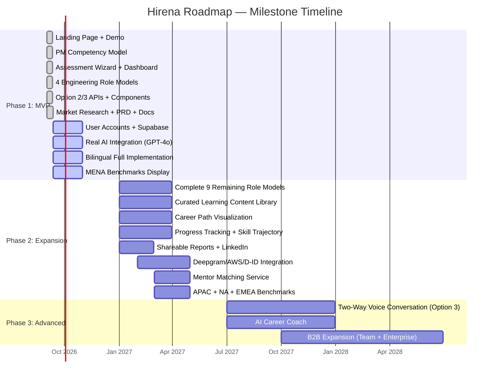
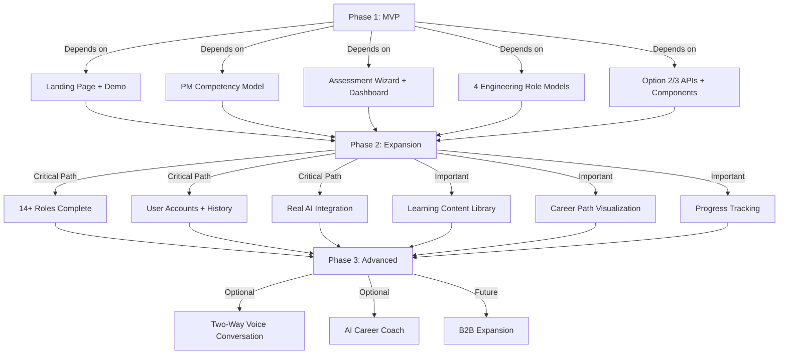

# Hirena — Roadmap

**Version:** 2.0  
**Last Updated:** September 12, 2026  
**Owner:** Ossama Mokhtar  

---

## Roadmap Overview

Hirena follows a 3-phase evolutionary roadmap aligned with the Option 1→2→3 architecture:

- **Phase 1 (Q3-Q4 2026):** MVP Launch — Core assessment + 5 role models + Option 2/3 APIs + demo
- **Phase 2 (Q1-Q2 2027):** Expansion — 14+ roles complete, real AI integration, user accounts, learning content, career path visualization
- **Phase 3 (Q3 2027+):** Advanced — Two-way voice conversation, AI career coach, B2B expansion (optional)

---

## Phase 1: MVP Launch (Q3-Q4 2026) — ✅ Mostly Complete

### Completed ✅

| deliverable | status | details |
|-------------|--------|---------|
| Landing page + demo | Done | HTTP 200, "See a demo" button, pre-computed result, localStorage persistence |
| PM competency model | Done | 35 skills, 6 pillars, career ladder APM→CPO, regional benchmarks |
| Assessment wizard (5-step) | Done | Profile → Goal → Self-Rate → AI Analysis → Review & Submit |
| Results dashboard | Done | Overall score, competency breakdown, skill ranking, gaps, roadmap |
| Scoring engine | Done | computeAssessmentResult() — merges AI + self, computes weighted scores |
| 4 engineering role models | Done | Software Engineer (38 skills), Frontend (36), Backend (31), Full-Stack (37), QA (29). 78 pillars total. |
| Option 2/3 APIs | Done | Voice/analyze, facial/analyze, fusion/result, interview/session (WebSocket) — all verified working |
| Real-time interview wizard | Done | 8-step wizard, TypeScript compiles, browser smoke test pending |
| Avatar mentor component | Done | CSS/SVG + TTS ready, TypeScript compiles |
| Market research + PRD | Done | Full competitor matrix, feature prioritization, market context, SWOT, JTBD |
| Architecture documentation | Done | HTML overview, data flow diagrams, workflow library, Mermaid center |
| Type system | Done | tsc --noEmit clean, npm run build passes |

### In Progress 🔄

| deliverable | status | details |
|-------------|--------|---------|
| Bilingual AR/EN full implementation | Active | RTL support ready, language toggle ready, full UI translation in progress |
| User accounts + Supabase auth | Active | Supabase placeholders exist, auth + profile storage + assessment history to wire |
| Bias mitigation + compliance | Active | Facial disclaimer + optional/experimental toggle needed, compliance documentation |
| MENA benchmarks (PM role) | Active | PM benchmarks data ready, display in results dashboard to implement |
| Real AI integration (GPT-4o) | Blocked | OpenAI balance $0 → 429. inferAllSkills() built + typed, needs credits to activate |

### Not Started 📋

| deliverable | priority | effort | dependencies |
|-------------|----------|--------|--------------|
| Complete 9 remaining role models | Critical | High (200+ skills) | None — standalone |
| Career roadmap enhancement | High | Medium | Role career ladders (built) |
| Learning content library | Medium | Medium | Content curation/partnerships |
| Career path visualization | High | Medium | Role career ladders (built) |
| Progress tracking + skill trajectory | High | Medium | User accounts (Phase 1) |
| Shareable reports + LinkedIn | Medium | Low | User accounts |

---

## Phase 2: Expansion (Q1-Q2 2027)

### Core Deliverables

| deliverable | priority | effort | dependencies | target |
|-------------|----------|--------|--------------|--------|
| Complete 9 remaining role models | Critical | High (200+ skills) | None | Q1 2027 |
| User accounts + profiles + history | Critical | Medium | Supabase setup | Q4 2026-Q1 2027 |
| Real AI integration (GPT-4o Vision + Whisper) | Critical | Medium | OpenAI credits, video upload | Q4 2026-Q1 2027 |
| Curated learning content library | High | Medium | Content curation/partnerships | Q1 2027 |
| Career path visualization | High | Medium | Role career ladders (built) | Q1 2027 |
| Progress tracking + skill trajectory | High | Medium | User accounts | Q1 2027 |
| Bilingual AR/EN full rollout | Critical | Medium | AR/EN translations for all features | Q2 2027 |
| MENA benchmarks (all 14+ roles) | High | Medium | Role models complete | Q2 2027 |
| Deepgram/AssemblyAI voice analysis | High | Low-Med | API keys, audio upload | Q2 2027 |
| AWS Rekognition/DeepFace facial analysis | Medium | Low-Med | API keys, video frames | Q2 2027 |
| D-ID/HeyGen avatar integration | Medium | Low-Med | API keys, avatar rendering | Q2 2027 |
| Shareable reports + LinkedIn sharing | Medium | Low | User accounts | Q1 2027 |
| Mentor matching service | Medium | Medium | User accounts, mentor profiles | Q2 2027 |
| Analytics dashboard enhancement | High | Medium | User accounts, benchmarks | Q2 2027 |

### Phase 2 Success Metrics

| metric | target |
|--------|--------|
| Registered users | 5,000+ |
| Assessment completions | 2,000+ |
| Weekly active users | 500+ |
| Career roadmap saves | 1,000+ |
| Shareable report shares | 500+ |
| User retention (30-day) | > 20% |
| Bilingual usage (AR) | > 30% |

---

## Phase 3: Advanced / Optional (Q3 2027+)

### Optional Advanced Features

| deliverable | priority | effort | notes |
|-------------|----------|--------|-------|
| Two-way voice conversation (Option 3) | Optional | High | Real-time WebSocket + voice streaming. $9-26/interview cost. Uncertain market fit. |
| 3D/2D avatar with lip-sync | Optional | Medium | Three.js + ReadyPlayerMe or 2D animated avatar. |
| AI career coach (conversational) | Optional | Medium | GPT-4o conversational guidance on career decisions. |
| Compensation + salary intelligence (MENA-specific) | Optional | Medium | MENA-specific salary data per role per level. |
| Gamification + engagement (badges, milestones) | Optional | Low | Optional engagement layer. |

### Future B2B Expansion (Out of Scope for MVP)

| deliverable | priority | effort | notes |
|-------------|----------|--------|-------|
| Team assessment + skill gap analysis | Future | High | Managers assess their team's skills. Requires user accounts + team features. |
| Internal talent marketplace | Future | High | Internal mobility, gig matching. Requires HCM integration + employee data. |
| Enterprise integrations (ATS/HRIS/LMS) | Future | High | API integrations with Greenhouse, Lever, Workday, etc. |
| Talent sourcing + candidate pool | Future | High | Find candidates by skill. Requires candidate database. |
| Anti-cheat / proctored assessments | Future | Medium | Proctored assessment mode for high-stakes use cases. |

---

## Milestone Timeline

---

## Dependency Graph

---

## Resource Planning

### Phase 1 (Q3-Q4 2026) — Current Team
| role | effort | status |
|------|--------|--------|
| Product (Ossama Mokhtar) | Full-time | Actively driving |
| Engineering | 1 FTE equivalent | Architecture built, competency models built, APIs built |
| Design | Light | Shadcn/UI + Tailwind, minimal custom design |

### Phase 2 (Q1-Q2 2027) — Growth Team
| role | effort | needs |
|------|--------|-------|
| Product Manager | 1 FTE | Feature prioritization, user research, roadmap management |
| Frontend Engineer | 1-2 FTE | Bilingual implementation, user accounts UI, career path viz, analytics dashboard |
| Backend/Infrastructure | 0.5 FTE | Supabase wiring, API enhancements, benchmarks data |
| AI/ML Engineer | 0.5 FTE | GPT-4o integration, voice/facial analysis optimization, bias testing |
| Content/Curation | 0.5 FTE | Learning content library, mentor matching, MENA benchmarks research |

### Phase 3 (Q3 2027+) — Scale Team
| role | effort | needs |
|------|--------|-------|
| Product Manager | 1 FTE | B2B strategy, advanced features |
| Frontend Engineer | 2 FTE | Real-time voice, avatar rendering, gamification |
| Backend Engineer | 1 FTE | Real-time WebSocket, scaling, performance |
| AI/ML Engineer | 1 FTE | Advanced AI features, model optimization, cost control |
| DevOps/SRE | 0.5 FTE | Infrastructure scaling, monitoring, reliability |
| GTM/Marketing | 1 FTE | User acquisition, B2B sales, partnerships |

---

## Risk-Overlay Roadmap

| risk | affected deliverables | mitigation | contingency |
|------|----------------------|------------|-------------|
| OpenAI credits unavailable / cost overrun | Real AI integration, interview practice | Phase 2 architecture allows swapping services; consider open-source models long-term | Extend simulation mode; focus on self-assessment + roadmap as core value |
| Facial analysis regulatory pressure | Facial analysis feature | Optional/experimental + disclaimer; voice + content as core | Drop facial analysis entirely if regulations tighten |
| 9 remaining role models take too long | Multi-role coverage | Prioritize most important roles first (DevOps, Data Engineer, UX/UI, Eng Manager) | Launch with 8-10 roles instead of 14+; add more over time |
| User acquisition slower than expected | All growth metrics | Focus on SEO, LinkedIn organic, partnerships, referrals | Extend Phase 1 timeline; delay Phase 2 until traction proven |
| B2C monetization doesn't work | Revenue, sustainability | Validate with small premium features first; iterate on pricing | Pivot to B2B enterprise (higher ticket, different sales cycle) |
| GPT-4o quality insufficient for skill inference | AI assessment accuracy | Test with credits; measure accuracy; iterate on prompts | Consider fine-tuning or different model; lower expectations for AI inference |

---

*End of Roadmap v2.0*
